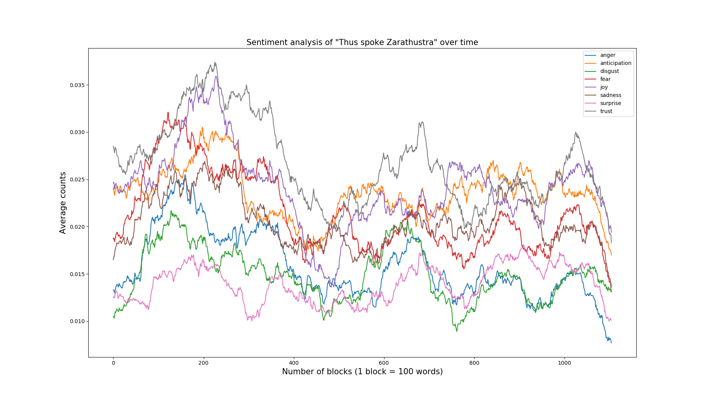

[](https://github.com/antropie/cryptobot/actions?query=build)
[](https://github.com/antropie/cryptobot/actions?query=analysis)
# LBSA - Lexicon-based Sentiment Analysis

Fast library for sentiment analysis, opinion mining and language detection.

## Installation

Install dependencies:
```sh
$ sudo pip3 install requirements.txt
```

From the parent folder, install the library by typing the following command:

```sh
$ sudo python3 setup.py install
```

To access the NRC lexicon, download it from:
http://www.saifmohammad.com/WebDocs/Lexicons/NRC-Emotion-Lexicon.zip

Extract it, and provide the path to the excel file the first time you use the NRC lexicon.
For example:
```python
>>> path = 'path/to/NRC-Emotion-Lexicon-v0.92-In105Languages-Nov2017Translations.xlsx'
>>> sa_lexicon = lbsa.get_lexicon('sa', language='english', source='nrc', path=path)
```


### Dependencies

* numpy >= 1.13.3
* pandas >= 0.21.0
* xlrd

## Features

### Sentiment analysis

```python
>>> import lbsa
>>> tweet = """
... The Budget Agreement today is so important for our great Military.
... It ends the dangerous sequester and gives Secretary Mattis what he needs to keep America Great.
... Republicans and Democrats must support our troops and support this Bill!
... """
>>> sa_lexicon = lbsa.get_lexicon('sa', language='english', source='nrc')
>>> sa_lexicon.process(tweet)
{'anger': 0, 'anticipation': 0, 'disgust': 0, 'fear': 2, 'joy': 0, 'sadness': 0, 
'surprise': 0, 'trust': 3}
```

### Opinion mining

```python
>>> op_lexicon = lbsa.get_lexicon('opinion', language='english', source='nrc')
>>> op_lexicon.process(tweet)
{'positive': 2, 'negative': 1}
```

### Language detection

Language detection requires the NRC lexicon:

```python
>>> import lbsa
>>> tweet = """
... A la suite de la tempête #Eunice et à la demande du Président de la République,
... lEtat décrétera dans les meilleurs délais létat de catastrophe naturelle partout
... où cela savérera nécessaire.
... """
>>> lexicon = lbsa.get_lexicon('sa', language='auto', source='nrc')
>>> print(lexicon.process(tweet))
{'anger': 2, 'anticipation': 1, 'disgust': 1, 'fear': 2, 'joy': 0, 'sadness': 2, 'surprise': 2,
'trust': 0, 'lang': 'french'}
```

### Feature extractor

```python
>>> extractor = lbsa.FeatureExtractor(sa_lexicon, op_lexicon)
>>> extractor.process(tweet)
array([0., 0., 0., 2., 0., 0., 0., 3., 2., 1.])
```

#### Example

Feature extractor:

[feature_extraction.py](https://github.com/AntoinePassemiers/Lexicon-Based-Sentiment-Analysis/blob/master/examples/feature_extraction.py)



Perform sentiment analysis over time on "Thus spoke Zarathustra":

[book.py](https://github.com/AntoinePassemiers/Lexicon-Based-Sentiment-Analysis/blob/master/examples/book.py)
